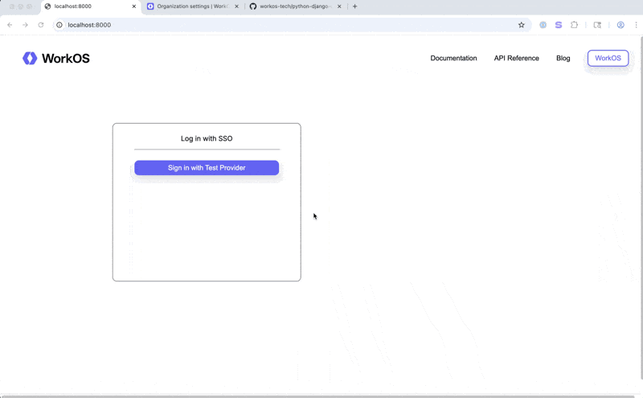

# WorkOS SSO Example Application

This Django application demonstrates how to integrate WorkOS Single Sign-On (SSO) using the Test Provider. After successful authentication, the application displays the user's first name, last name, organization ID, and organization name.

## Features

- ✅ SSO authentication using WorkOS Test Provider
- ✅ Displays user's first name and last name
- ✅ Displays organization ID
- ✅ Displays organization name (bonus feature - requires additional API call)

## Demo Video

A screen recording demonstrating the complete SSO authentication flow:



**📹 [Download Full Video (MP4)](sso/static/images/WorkOSDemo.mp4)**

The demo demonstrates:
- Login page with "Sign in with Test Provider" button
- Authentication flow using Test Provider with `@example.com` email address
- Successful redirect and display of:
  - **First Name**
  - **Last Name**
  - **Organization ID**
  - **Organization Name** (bonus feature)

**Note:** When testing yourself, remember that the email address **must end with `@example.com`** for the Test Provider to work.

## Prerequisites

- **Python 3.6 or higher** (check with `python3 --version`)
- **A free WorkOS account** - [Sign up here](https://dashboard.workos.com/)
- **pip** (Python package manager)

## Detailed Steps to Run the App Locally

### Step 1: Navigate to the Project Directory

Navigate to the `python-django-sso-example` directory:

```bash
cd python-django-sso-example
```

### Step 2: Create a Virtual Environment

Create and activate a Python virtual environment to isolate dependencies:

```bash
# Create virtual environment
python3 -m venv env

# Activate virtual environment
# On macOS/Linux:
source env/bin/activate

# On Windows:
# env\Scripts\activate
```

You should see `(env)` at the beginning of your command prompt, indicating the virtual environment is active.

### Step 3: Install Dependencies

Install all required Python packages:

```bash
pip install -r requirements.txt
```

This will install:
- Django 4.1.3
- WorkOS Python SDK (v5.33.0+)
- python-dotenv (for loading environment variables)
- Other dependencies

### Step 4: Set Up WorkOS Account and Get Credentials

#### 4.1 Create WorkOS Account

1. Go to [https://dashboard.workos.com/](https://dashboard.workos.com/)
2. Sign up for a free account if you don't have one

#### 4.2 Get API Key and Client ID

1. **Get API Key:**
   - In the WorkOS Dashboard, navigate to **Developer** → **API Keys**
   - Copy your API Key (starts with `sk_test_...` or `sk_live_...`)

2. **Get Client ID:**
   - In the WorkOS Dashboard, navigate to **Configuration** → **Authentication**
   - Copy your Client ID (starts with `client_01...`)

#### 4.3 Set Up Test Provider

1. Navigate to **Organizations** in the WorkOS Dashboard
2. Create a new organization (or use an existing one)
3. **Note the Organization ID** (starts with `org_01...`) - you'll need this
4. Click on your organization to open it
5. Go to the **Connections** tab
6. Click **Add Connection** or **New Connection**
7. Select **Test Provider** as the connection type
8. Assign it to your organization
9. Save the connection

#### 4.4 Configure Redirect URI

1. In the WorkOS Dashboard, go to **Configuration** → **Authentication**
2. Find the **Redirect URIs** or **Allowed Redirect URIs** section
3. Add: `http://localhost:8000/auth/callback`
4. Save the configuration

**⚠️ CRITICAL: Test Provider Email Domain Requirement**

The WorkOS Test Provider **only accepts email addresses ending with `@example.com`**. 

**You must:**
- Use an email like `test@example.com`, `user@example.com`, or `anything@example.com`
- **DO NOT** use real email domains like `@gmail.com`, `@company.com`, etc. (they will be rejected)

**To ensure this works:**
- In WorkOS Dashboard → Organizations → [Your Organization] → Settings
- Make sure `example.com` is in the allowed domains list, OR
- Disable domain restrictions for the Test Provider connection

### Step 5: Configure Environment Variables

Create a `.env` file in the `python-django-sso-example` directory:

```bash
# Create .env file
touch .env
```

Open the `.env` file in a text editor and add the following environment variables:

```bash
# WorkOS API Configuration
# Get these from WorkOS Dashboard → Developer → API Keys
WORKOS_API_KEY=Insert your WorkOS API key here

# Get this from WorkOS Dashboard → Configuration → Authentication
WORKOS_CLIENT_ID=Insert your WorkOS Client ID here

# Organization ID for Test Provider
# Get this from WorkOS Dashboard → Organizations → [Your Organization] → Copy Organization ID
WORKOS_ORGANIZATION_ID=Insert your Organization ID here

# Redirect URI - must match what you configured in WorkOS Dashboard
REDIRECT_URI=http://localhost:8000/auth/callback
```

**Replace the placeholder values with your actual credentials:**

- `WORKOS_API_KEY`: Your API Key from Step 4.2 (starts with `sk_test_...` or `sk_live_...`)
- `WORKOS_CLIENT_ID`: Your Client ID from Step 4.2 (starts with `client_01...`)
- `WORKOS_ORGANIZATION_ID`: Your Organization ID from Step 4.3 (starts with `org_01...`)
- `REDIRECT_URI`: Keep as `http://localhost:8000/auth/callback` (must match WorkOS Dashboard configuration)

**Example `.env` file:**
```bash
WORKOS_API_KEY=Insert your WorkOS API key here
WORKOS_CLIENT_ID=Insert your WorkOS Client ID here
WORKOS_ORGANIZATION_ID=Insert your Organization ID here
REDIRECT_URI=http://localhost:8000/auth/callback
```

**⚠️ Important:** Replace all placeholder values with your actual credentials from the WorkOS Dashboard. Never commit real API keys to version control.

**Security Note:** The `.env` file is already in `.gitignore`, so your credentials won't be committed to version control.

### Step 6: Run Database Migrations

Initialize the Django database:

```bash
python manage.py migrate
```

You should see output like:

```
Operations to perform:
  Apply all migrations: admin, auth, contenttypes, sessions
Running migrations:
  Applying contenttypes.0001_initial... OK
  Applying auth.0001_initial... OK
  ...
```

### Step 7: Start the Development Server

Start the Django development server:

```bash
python manage.py runserver
```

You should see output similar to:

```
Watching for file changes with StatReloader
Performing system checks...

System check identified no issues (0 silenced).
Django version 4.1.3, using settings 'workos_django.settings'
Starting development server at http://127.0.0.1:8000/
Quit the server with CONTROL-C.
```

**Note:** If you see CSS/images not loading, you may need to run with the `--insecure` flag:

```bash
python manage.py runserver --insecure
```

### Step 8: Test the Application

**⚠️ IMPORTANT: Test Provider Email Requirement**

Before testing, remember that the WorkOS Test Provider **only accepts email addresses ending with `@example.com`**. You cannot use real email domains like `@gmail.com` or `@company.com`.

1. **Open your web browser** and navigate to: `http://localhost:8000`

2. **You should see:**
   - A login page with the WorkOS logo
   - A blue button labeled "Sign in with Test Provider"

3. **Click "Sign in with Test Provider"**

4. **You will be redirected to the WorkOS Test Provider login page**

5. **Enter Test Provider credentials:**
   - **⚠️ IMPORTANT: Email must end with `@example.com`**
     - Valid examples: `test@example.com`, `user@example.com`, `john@example.com`
     - Invalid examples: `test@gmail.com`, `user@company.com` (will not work)
   - **First Name:** Any name (e.g., `John`, `Jane`)
   - **Last Name:** Any name (e.g., `Doe`, `Smith`)
   - Click **Continue** or **Sign In**

6. **After successful authentication:**
   - You will be redirected back to `http://localhost:8000`
   - You should see a success page displaying:
     - ✅ **First Name:** (your entered first name)
     - ✅ **Last Name:** (your entered last name)
     - ✅ **Organization ID:** (your organization ID)
     - ✅ **Organization Name:** (your organization name - bonus feature)
     - Raw profile data in JSON format

7. **To log out:** Click the "Log Out" button in the top right

## Environment Variables Reference

The following environment variables **must** be set in your `.env` file:

| Variable | Description | Where to Find It | Example Format |
|----------|-------------|------------------|----------------|
| `WORKOS_API_KEY` | Your WorkOS API key | Dashboard → Developer → API Keys | Starts with `sk_test_...` or `sk_live_...` |
| `WORKOS_CLIENT_ID` | Your WorkOS Client ID | Dashboard → Configuration → Authentication | Starts with `client_01...` |
| `WORKOS_ORGANIZATION_ID` | Organization ID with Test Provider | Dashboard → Organizations → [Your Org] → Copy ID | Starts with `org_01...` |
| `REDIRECT_URI` | OAuth callback URL | Must match Dashboard config | `http://localhost:8000/auth/callback` |

**All environment variables are required.** The application will not work without them.

## Troubleshooting

### Environment Variables Not Loading

**Symptoms:** Application shows errors about missing credentials

**Solutions:**
- Ensure `.env` file is in the `python-django-sso-example` directory (same level as `manage.py`)
- Verify variable names are correct (case-sensitive, no spaces)
- Check that values don't have quotes around them (unless part of the value)
- Restart the Django server after modifying `.env`

### Authentication Fails with "Invalid client ID"

**Solutions:**
- Verify `WORKOS_CLIENT_ID` matches the value in WorkOS Dashboard
- Ensure the Client ID is from **Configuration → Authentication** (not API Keys)
- Check for typos or extra spaces in `.env` file

### "Profile does not belong to the target Organization" Error

**Symptoms:** Error message about domain not matching (e.g., "The domain 'gmail.com' does not match")

**Solutions:**
- **⚠️ You MUST use an email ending with `@example.com`** (e.g., `test@example.com`)
- The Test Provider only accepts `@example.com` email addresses
- Do NOT use real email domains like `@gmail.com`, `@company.com`, etc.
- Ensure your organization allows `example.com` domain:
  - In WorkOS Dashboard → Organizations → [Your Org] → Settings
  - Add `example.com` to allowed domains OR disable domain restrictions
  - For Test Provider, you can enable "Allow unlisted domains"

### Organization Name Not Displaying

**Solutions:**
- Check that `WORKOS_ORGANIZATION_ID` is correct
- Verify your API key has permissions to read organization data
- Check Django server terminal for error messages
- Organization name is a bonus feature - app will work without it

### CSS/Images Not Loading

**Solutions:**
- Run server with `--insecure` flag: `python manage.py runserver --insecure`
- Or set `DEBUG=True` in `workos_django/settings.py` (for local development only)
- Ensure static files were collected: `python manage.py collectstatic`

### Server Won't Start

**Solutions:**
- Ensure virtual environment is activated (`(env)` in prompt)
- Check that all dependencies are installed: `pip install -r requirements.txt`
- Verify Python version: `python3 --version` (needs 3.6+)
- Check for port conflicts (another app using port 8000)

## Application Structure

```
python-django-sso-example/
├── manage.py                    # Django management script
├── requirements.txt             # Python dependencies
├── .env                         # Environment variables (create this - not in repo)
├── .env.example                 # Example environment variables template
├── README.md                    # This file
├── workos_django/               # Django project settings
│   ├── settings.py             # Django configuration
│   └── urls.py                 # Main URL routing
└── sso/                         # SSO application
    ├── views.py                # Authentication logic (4 functions)
    ├── urls.py                 # SSO URL routing
    ├── templates/              # HTML templates
    │   └── sso/
    │       ├── login.html
    │       └── login_successful.html
    └── static/                 # CSS and images
        ├── css/
        │   └── login.css
        └── images/
            └── workos-logo-with-text.png
```

## How It Works

1. **User visits `/`** → `login()` function checks session
2. **User clicks "Sign in"** → `auth()` function generates WorkOS authorization URL
3. **User authenticates** → WorkOS Test Provider validates credentials
4. **WorkOS redirects back** → `auth_callback()` function processes response
5. **Profile extraction** → Extracts first name, last name, organization ID
6. **Organization lookup** → Makes additional API call for organization name (bonus)
7. **Session storage** → Stores all data in Django session
8. **Success page** → `login()` function detects active session and shows user info

## Additional Resources

- [WorkOS SSO Documentation](https://workos.com/docs/sso)
- [WorkOS Test Provider Documentation](https://workos.com/docs/sso/test-sso)
- [WorkOS Python SDK](https://github.com/workos/workos-python)
- [WorkOS API Reference](https://workos.com/docs/reference)

## Need Help?

If you encounter issues:

1. Check the [WorkOS Documentation](https://workos.com/docs)
2. Review the [WorkOS API Reference](https://workos.com/docs/reference)
3. Check Django server terminal output for error messages
4. Verify all environment variables are set correctly
5. Contact WorkOS support at support@workos.com

## License

This example application is provided as-is for demonstration purposes.
